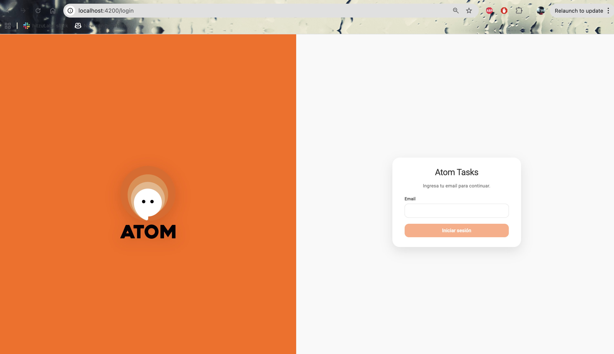
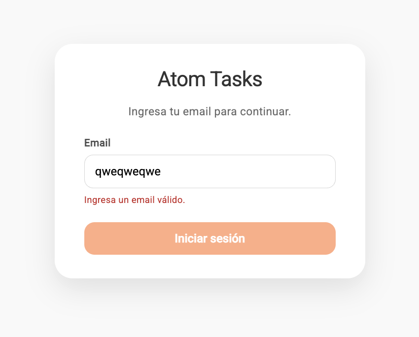
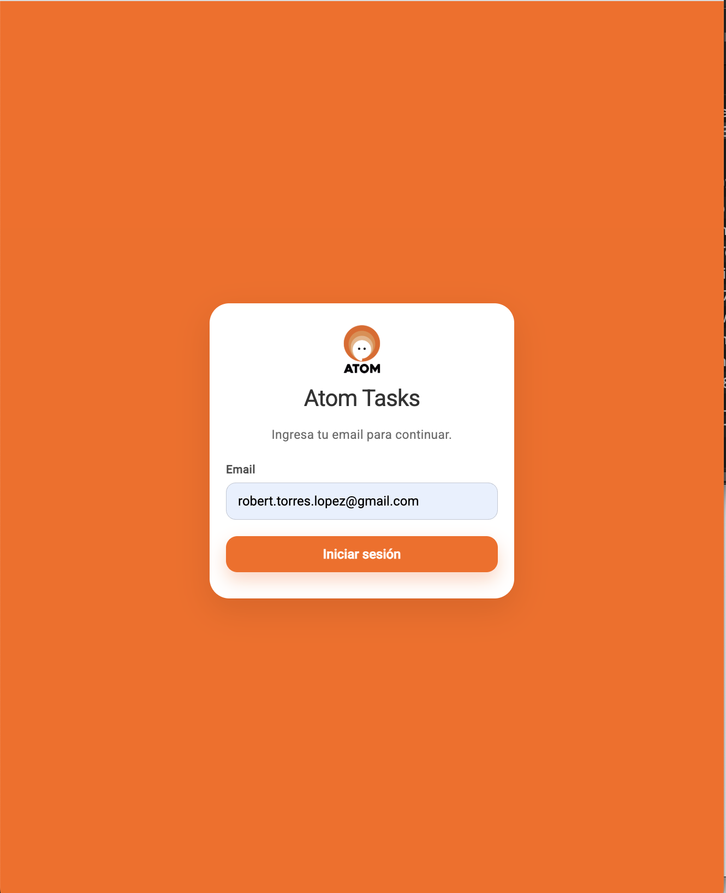
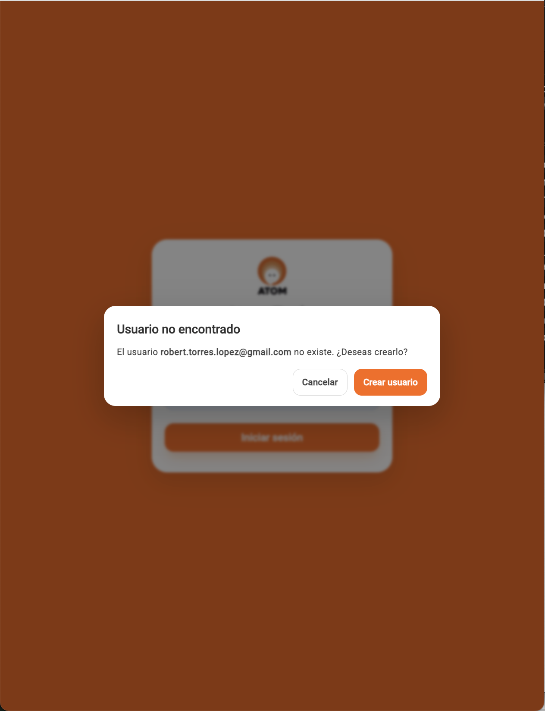
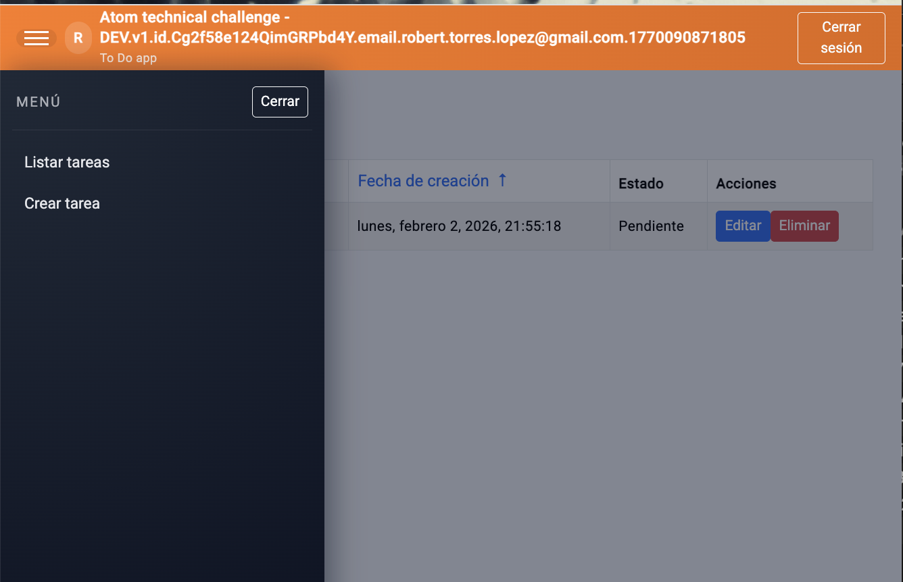
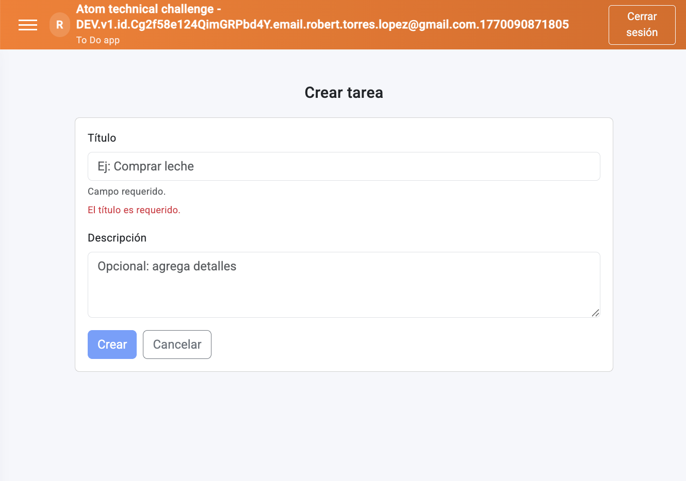
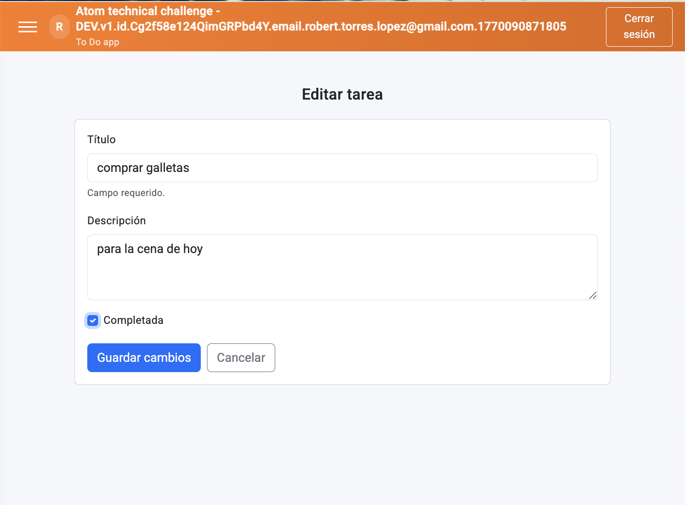

# Atom Tech Challenge — Fullstack Monorepo

Demo desplegada: `https://atom-todo-3ed1b.web.app/`

Aplicación de lista de tareas (To-Do) con:

- `front` — App en **Angular 17 + Angular Material + Bootstrap**.
- `back` — API en **Express + TypeScript** con una arquitectura limpia (pseudo hexagonal).
- `CI/CD` — Deploy y tests usando **GitHub Actions** en **Firebase Cloud Functions** y **Firestore**.
- `shared` — **Zod schemas + tipos TypeScript compartidos** entre front y back.

El objetivo es demostrar:

- Buenas prácticas de **arquitectura front/back**.
- Uso de **Firestore + Angular** en desarrollo.
- Flujo de trabajo realista con diferentes tradeoffs.

---

## 1. Stack

### Backend

- Node.js 20
- Express
- Firestore
- Vitest

### Frontend

- Angular
- Angular Material
- Bootstrap
- [`Manual de identidad`](https://atomchat.io/manualdemarcapartners/).

### 1.1. Documentación (para el revisor)

Si tienes poco tiempo, te recomiendo este orden:

1. `docs/technical_decisions.md` → visión general y decisiones clave.
2. `docs/data_model.md` → modelo de datos y relaciones principales.
3. `README.md` (esta página) → cómo ejecutar la demo paso a paso.

Documentos disponibles:

- [`docs/technical_assessment.md`](docs/technical_assessment.md): enunciado oficial de la prueba.
- [`docs/data_model.md`](docs/data_model.md): modelo de datos (ER + explicación tabla por tabla).
- [`docs/technical_decisions.md`](docs/technical_decisions.md): decisiones técnicas y tradeoffs.
- [`docs/future_work.md`](docs/future_work.md): Mejoras ante el diseño propuesto.
- [`docs/design_doc.md`](docs/design_doc.md): diseño detallado y archivo base que guió el desarrollo del MVP.
- [`docs/ci_cd.md`](docs/ci_cd.md): información sobre deploys y pipelines

## 2. Cómo levantar el proyecto (desarrollo)

### 2.1 Opción A — Docker (recomendada para el revisor)

Requisitos:

- Docker Desktop (o Docker Engine + Docker Compose).

Comando:

```bash
docker compose up --build
```

Servicios:

```bash
Frontend: http://localhost:4173

Backend API: http://localhost:4000/api

Health: http://localhost:4000/health
```

Notas:

El frontend corre en Nginx y enruta `/api/*` hacia el backend.

El emulador de Firestore corre dentro de la red de Docker; no expone puertos al host (no es necesario abrir la UI del emulador para probar la app).

### 2.2 Opción B — Desarrollo local sin Docker

Requisitos:

Node.js: ≥ 20

npm

Java 21 (requerido por Firebase emulators).
Recomendado: Eclipse Temurin (OpenJDK) instalado como JDK por defecto.

Firebase CLI (global o via npx).

```bash
npm install -g firebase-tools
```

o

```bash
npx firebase-tools --version
```

Ambas opciones son válidas para los pasos siguientes.

#### 2.2.1 Instalar dependencias

Desde la raíz del monorepo:

```bash
npm install
```

#### 2.2.2 Variables de entorno para backend

Valores recomendados para desarrollo:

```bash
export PORT=4000
export FIREBASE_PROJECT_ID=demo-project
export GCLOUD_PROJECT=demo-project
export FIRESTORE_EMULATOR_HOST=localhost:8080
export JWT_SECRET=dev-secret
export ALLOW_INSECURE_HEADER_AUTH=true
```

#### 2.2.3 Levantar Firestore emulator

El repo incluye configuración en back/firebase.json (Firestore en puerto 8080).

Opción A — usando npx (sin instalar nada global):

```bash
npx firebase-tools --config back/firebase.json --project demo-project emulators:start --only firestore
```

Opción B — usando Firebase CLI global:

```bash
npm install -g firebase-tools
firebase --config back/firebase.json --project demo-project emulators:start --only firestore
```

#### 2.2.4 Levantar backend en modo dev

En otra terminal (desde la raíz):

```bash
export FIREBASE_PROJECT_ID=demo-project
export GCLOUD_PROJECT=demo-project
export FIRESTORE_EMULATOR_HOST=localhost:8080
npm run dev:back
```

API base: http://localhost:4000/api

Health: http://localhost:4000/health

### 2.2.5 Levantar frontend en modo dev

En otra terminal (desde la raíz):

```bash
npm run dev:front
```

Frontend: http://localhost:4200

#### 2.2.6 Comandos útiles

Desde la raíz del monorepo:

```bash
# levantar front + back (dev)
npm run dev

# tests (backend + frontend)
npm test

# lint (backend + frontend)
npm run lint

# build (backend + frontend)
npm run build
```

Notas:

- Tests de backend requieren Firestore Emulator (y Java 21 si usas Firebase emulators).

## 3. Guía mínima de API (para el revisor)

Esta sección está basada en la colección de Bruno incluida en `back/collection-atom/atom`.

### 3.1 Base URLs

- Local: `http://localhost:4000/api`
- Deploy: `https://atom-todo-3ed1b.web.app/api`

### 3.2 Resumen operativo (cómo “probar” la app vía API)

1. Obtener token con `POST /auth/sign-in` enviando un `email`.
2. Llamar endpoints de tareas con el header `Authorization: Bearer <token>`.
3. (Opcional, solo dev) Usar headers “inseguros” `x-user-id` y `x-user-email` si el backend está levantado con `ALLOW_INSECURE_HEADER_AUTH=true`.

**Nota sobre el token DEV (MVP)**:

- El backend emite un token de demo con formato `DEV.v1.id.<userId>.email.<email>.<timestampMs>`.
- No hay revocación de tokens en este MVP (es un mecanismo “stateless” para el challenge).
- Detalle: ver [`docs/data_model.md`](docs/data_model.md).

### 3.3 Endpoints

#### App

- `GET /health` (sin `/api`)

#### Auth / Users

- `POST /api/auth/sign-in`
- `GET /api/users/:email`

#### Tasks (requiere auth)

- `GET /api/tasks?sort=asc|desc&status=PENDING|COMPLETED`
- `POST /api/tasks`
- `GET /api/tasks/:id`
- `PATCH /api/tasks/:id`
- `DELETE /api/tasks/:id`

### 3.4 Ejemplos rápidos (curl)

#### 1) Login (obtener JWT)

```bash
curl -sS -X POST "http://localhost:4000/api/auth/sign-in" \
  -H "Content-Type: application/json" \
  -d '{"email":"bruno.test+atom@local.dev"}'
```

#### 2) Crear tarea

```bash
curl -sS -X POST "http://localhost:4000/api/tasks" \
  -H "Content-Type: application/json" \
  -H "Authorization: Bearer <PEGAR_TOKEN_AQUI>" \
  -d '{"title":"Mi primer task","description":"Creado desde curl"}'
```

#### 3) Listar tareas (orden desc)

```bash
curl -sS "http://localhost:4000/api/tasks?sort=desc" \
  -H "Authorization: Bearer <PEGAR_TOKEN_AQUI>"
```

#### 4) Marcar como completada (PATCH)

```bash
curl -sS -X PATCH "http://localhost:4000/api/tasks/<TASK_ID>" \
  -H "Content-Type: application/json" \
  -H "Authorization: Bearer <PEGAR_TOKEN_AQUI>" \
  -d '{"completed": true}'
```

### 3.5 Colección de Bruno

- Ruta: `back/collection-atom/atom`
- Environments: `local.bru` y `prod.bru`
- Incluye casos “happy path” y “edge cases” (validación, auth, ids inexistentes, etc.).

## 4. Overview del sistema

### 4.1 Login

**Desktop**: layout dividido, logo de Atom y formulario con email + botón de continuar.



**Errores de validación**: estado de error visible si se agrega un email incorrecto.



**Móvil**: fondo en color principal, logo centrado y formulario a ancho completo.



**Usuario inexistente**: el sistema avisa y solicita confirmar creación.



### 4.2 Dashboard de tareas

**Desktop**:

- Menú lateral con opciones (lista, crear).
- Tabla/lista de tareas con: título, descripción, fecha, estado (checkbox).
- Acciones: editar / eliminar.


**Móvil**:

- Menú accesible vía botón hamburguesa.
- Lista responsive con scroll.
- Acciones alineadas para uso táctil.



### 4.3 Formularios (crear / editar)

**Crear tarea**: formulario con validaciones y accesibilidad.



**Editar tarea**: formulario con validaciones y accesibilidad.



## 5. CI/CD y deploy

- Workflows: [`CI/CD`](.github/workflows/ci-cd.yml)
- Runs (historial): `https://github.com/hitzu/Atom-Technical-Challenge/actions`
- Detalles (jobs, secrets, emuladores): [`docs/ci_cd.md`](docs/ci_cd.md)
