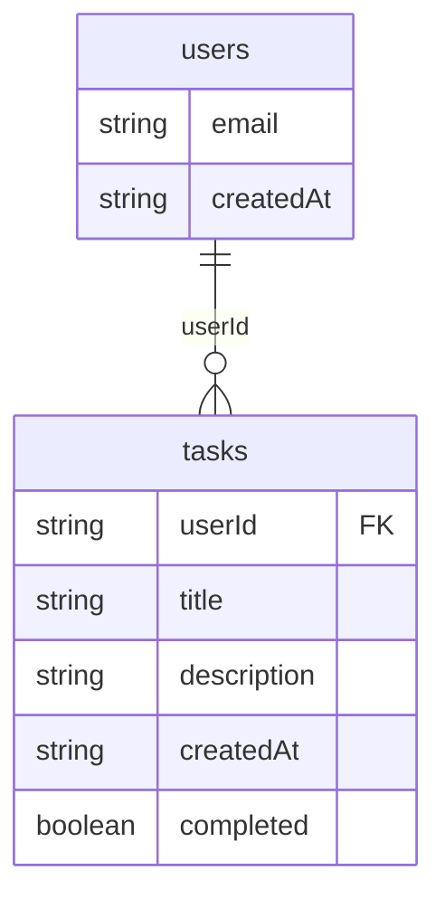

# Modelo de datos (Firestore)

> Nota: este MVP usa **Firebase Firestore** (NoSQL), así que hablamos de **colecciones** y **documentos**.
>
> Convenciones usadas en este repo:
>
> - Todos los documentos se leen/escriben con un `id` (string) que corresponde al **document id** de Firestore.
> - Se persiste `createdAt` como **string ISO 8601** (por ejemplo `2026-02-02T18:10:00.000Z`) para ordenar.

---

## 1. Diagrama (Mermaid)

---

## 2. Conceptos clave del modelo

### 2.1 Identidad y autenticación (token DEV “stateless”)

- El “login” es por **email**.
- El backend genera un token de demo (no se guarda en Firestore):
  - Formato: `DEV.v1.id.<userId>.email.<email>.<timestampMs>`
  - Se parsea en `authMiddleware` y se hidrata `req.user = { userId, email }`.
- El middleware también soporta JWT “real” (verificación con `JWT_SECRET`) y un modo inseguro opcional por headers:
  - `Authorization: Bearer <token>`
  - `x-user-id` / `x-user-email` si `ALLOW_INSECURE_HEADER_AUTH=true`

**Implicación**: como el token DEV no se persiste, este MVP **no implementa revocación** de tokens.

### 2.2 Ownership de tareas (aislamiento por usuario)

- La colección `tasks` se considera **propiedad** de un usuario vía `userId`.
- El API aplica ownership de dos maneras:
  - **Listados**: `GET /tasks` siempre consulta `where('userId', '==', <req.user.userId>)`.
  - **Accesos directos**: `GET/PATCH/DELETE /tasks/:id` valida que `task.userId === req.user.userId`; si no, responde `403`.

### 2.3 Consultas e índices esperados (Firestore)

- `users`:
  - Lookup por email: `where('email', '==', email).limit(1)`
- `tasks`:
  - Listado: `where('userId', '==', userId).orderBy('createdAt', sort)`
  - En un proyecto real, esto normalmente requiere un **índice compuesto** (`userId` + `createdAt`) según configuración del proyecto Firestore.
  - Filtro por estado:
    - `status=PENDING` actualmente se filtra en memoria (`completed == false`) luego de leer los docs del usuario, **Evitando generar indices**.

### 2.4 Fechas y ordenamiento

- `createdAt` se guarda como ISO 8601 en UTC.
- El orden lexicográfico de ISO 8601 coincide con el orden cronológico, por eso se puede usar `orderBy('createdAt')`.

---

## 3. Colecciones (detalle)

> En esta sección, `id` se refiere al **document id** de Firestore.  
> Las columnas listadas son los campos que se persisten en el documento (además del `id`).

### 3.1 `users`

Usuarios que inician sesión con su correo.

| Campo       | Tipo     | Descripción                                      |
| ----------- | -------- | ------------------------------------------------ |
| `email`     | `string` | Email normalizado (trim + lowercase) y validado. |
| `createdAt` | `string` | ISO datetime de creación.                        |

**Notas**

- Fuente de verdad del contrato: `shared/src/validation/user.schema.ts`.
- “Unicidad” de email:
  - Firestore no la garantiza por sí solo.
  - El backend consulta por email con `limit(1)`, así que el sistema se comporta como si `email` fuera único.

---

### 3.2 `tasks`

Tareas de un usuario.

| Campo         | Tipo      | Descripción                                                |
| ------------- | --------- | ---------------------------------------------------------- |
| `userId`      | `string`  | ID del usuario dueño de la tarea (document id en `users`). |
| `title`       | `string`  | Título de la tarea.                                        |
| `description` | `string?` | Descripción opcional.                                      |
| `createdAt`   | `string`  | ISO datetime de creación (usado para ordenar).             |
| `completed`   | `boolean` | `false` = pendiente, `true` = completada.                  |

**Notas**

- Fuente de verdad del contrato: `shared/src/validation/task.schema.ts`.
- El `PATCH /tasks/:id` permite updates parciales (`title`, `description`, `completed`) y **no** mantiene `updatedAt` en el modelo actual.
- `DELETE /tasks/:id` borra el documento (no hay soft-delete en este MVP).
